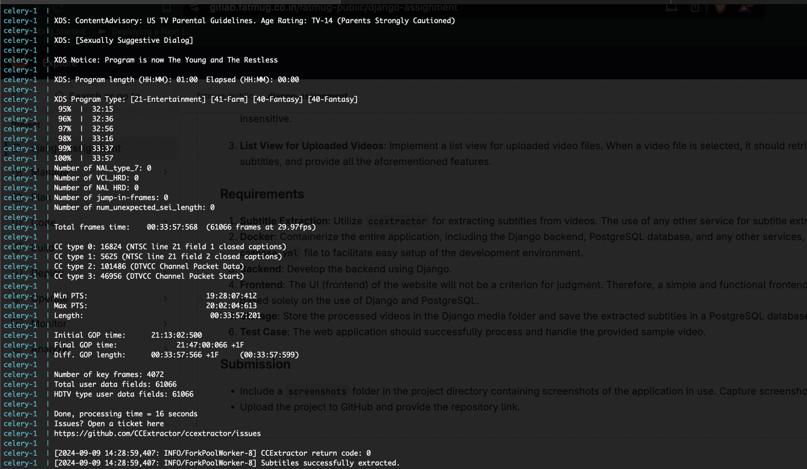
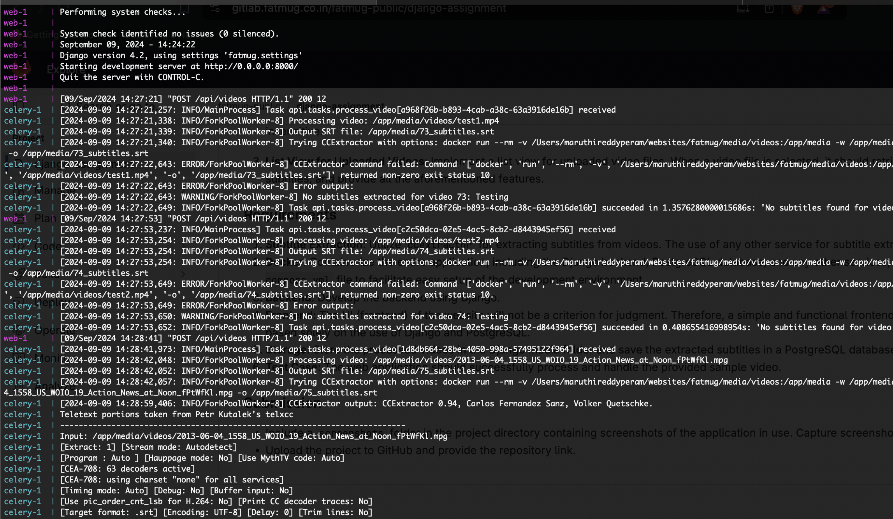
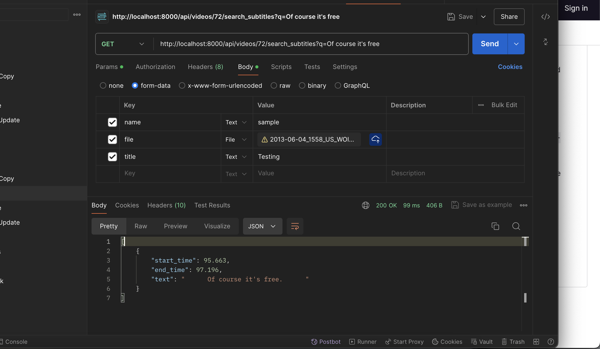
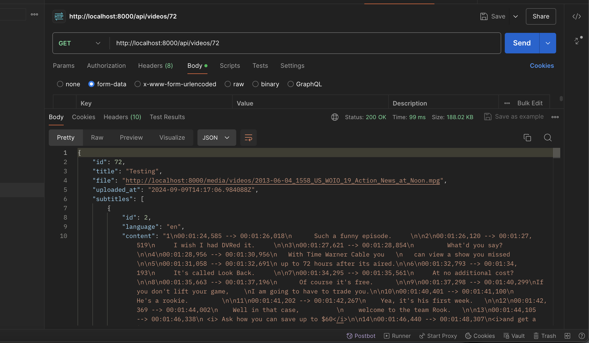
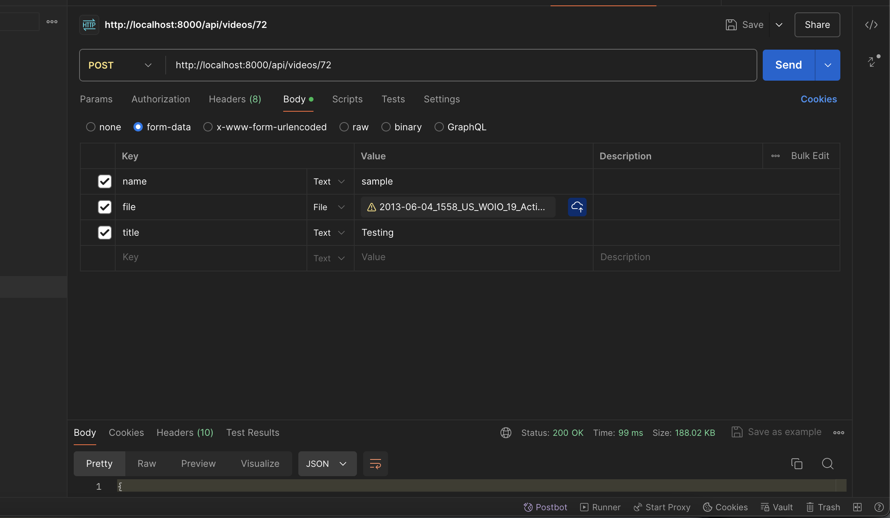

# Video Upload and Processing Project

This project allows users to upload videos, extract subtitles using CCExtractor, search within the subtitles for phrases, and jump to specific parts of the video based on the search results.

## Features

- **Video Upload**: Users can upload videos to the platform, which are then processed in the background to extract subtitles.
- **Subtitle Extraction**: Subtitles are automatically extracted from videos using CCExtractor and stored in the database for search and retrieval.
- **Search Subtitles**: Users can search within subtitles for specific phrases. The search is case-insensitive, and results are presented with corresponding timestamps.
- **Video Playback with Timestamp Seeking**: Users can click on a timestamp in the search results to jump to that specific moment in the video and start playback from there.

## Technology Stack

- **Backend**: Django 5.0, Django REST Framework
- **Task Queue**: Celery with Redis
- **Database**: PostgreSQL
- **Subtitle Extraction**: CCExtractor
- **Frontend**: NA
- **Containerization**: Docker, Docker Compose

## Setup Instructions

### Prerequisites

- Install Docker and Docker Compose
- Install Git to clone the repository

### Steps to Run the Project

1. **Clone the repository:**
   ```bash
   git clone <repository-url>
   cd <repository-directory>
   ```

2. **Environment Variables:**
   Create a `.env` file in the root directory with the following content:
   ```
   HOST_MEDIA_PATH=/absolute/path/to/your/local/media  # Adjust this to match your local setup
   POSTGRES_DB=postgres
   POSTGRES_USER=postgres
   POSTGRES_PASSWORD=postgres
   CELERY_BROKER_URL=redis://redis:6379/0
   CELERY_RESULT_BACKEND=redis://redis:6379/0
   ```

3. **Build and run the project:**
   ```bash
   sh start_services.sh
   ```
4. **Access the Application:**
   The application should now be running on `http://localhost:8000`.

5. **Access the Admin Panel:**
   You can access the Django admin panel at `http://localhost:8000/admin/` to manage videos, subtitles, and other resources.

## Functionality Overview

### 1. Video Upload
- Users can upload videos via the `/videos/upload` API endpoint.
- Once uploaded, Celery processes the video in the background to extract subtitles using CCExtractor.
- Subtitles are saved in the database associated with the uploaded video.

### 2. Search Subtitles
- Users can search subtitles for specific phrases via the `/videos/<video_id>/search?q=<phrase>` API endpoint.
- The search is case-insensitive and returns the timestamp and text of the matched subtitles.
- Example: `/api/videos/72/search_subtitles?q=Of course it's free`
    ```
    [
        {
            "start_time": 95.663,
            "end_time": 97.196,
            "text": "      Of course it's free.      "
        }
    ]
    ```
### 3. Jump to Timestamp in Video (Assumption)
- In the frontend, search results are displayed with clickable timestamps.
- When a user clicks on a timestamp, the video player seeks to that timestamp and starts playing the video from there.

## Example API Endpoints

- **Video Upload**: `POST /api/videos/`
  - Uploads a video and triggers background subtitle extraction.
- **Search Subtitles**: `GET /api/videos/<video_id>/search?q=<phrase>`
  - Searches within the video's subtitles and returns matched phrases with timestamps.

## Important Files

- `Dockerfile`: Defines how the Django and Celery environments are built.
- `Dockerfile.ccextractor`: Defines how the CCExtractor image is built.
- `docker-compose.yml`: Configuration for setting up the services like web, celery, db, redis, and ccextractor.
- `media/`: Directory where uploaded videos and extracted subtitles are stored.

## Celery Task Example

The subtitle extraction is performed by a Celery task that runs in the background. This task invokes CCExtractor to process the uploaded video and store the subtitles.

```python
from celery import shared_task
import subprocess
import os

@shared_task
def process_video(video_id):
    video_path = f"/app/media/videos/{video_id}.mp4"
    output_srt = f"/app/media/{video_id}_subtitles.srt"

    command = [
        'docker', 'run', '--rm',
        '-v', f"{os.getenv('HOST_MEDIA_PATH')}:/app/media",
        '-w', '/app/media',
        'ccextractor:latest', video_path, '-o', output_srt
    ]

    result = subprocess.run(command, capture_output=True, text=True)
    # Process the subtitles and save to the database
```

## Testing

1. Ensure that the ccextractor Docker image is working correctly:
   ```bash
   docker compose exec web ccextractor --help
   ```

## Conclusion

This project demonstrates how to build a backend solution for video upload, subtitle extraction, and search functionality using Django, Celery, Docker, and CCExtractor. The system is designed to be modular and scalable, allowing for easy integration with other video processing tools.


## Points to remember
1. Not able to extract subtitle from some sample video except the one's I downloaded from their github repo






